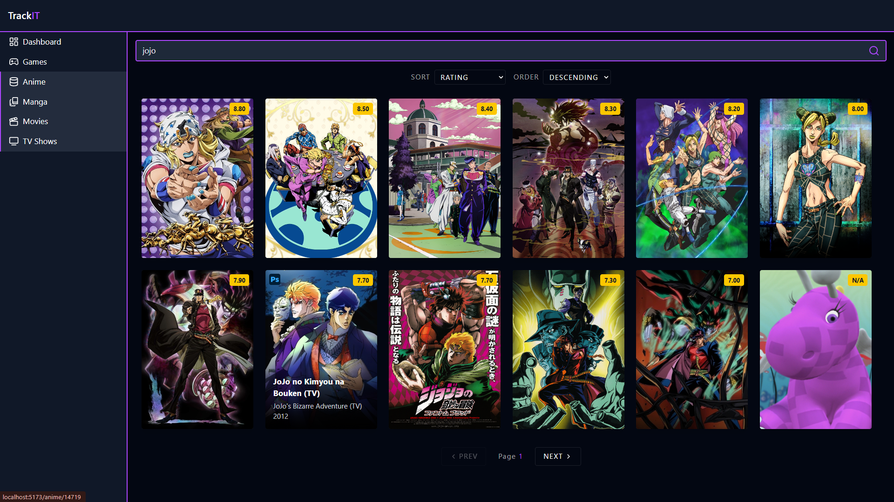
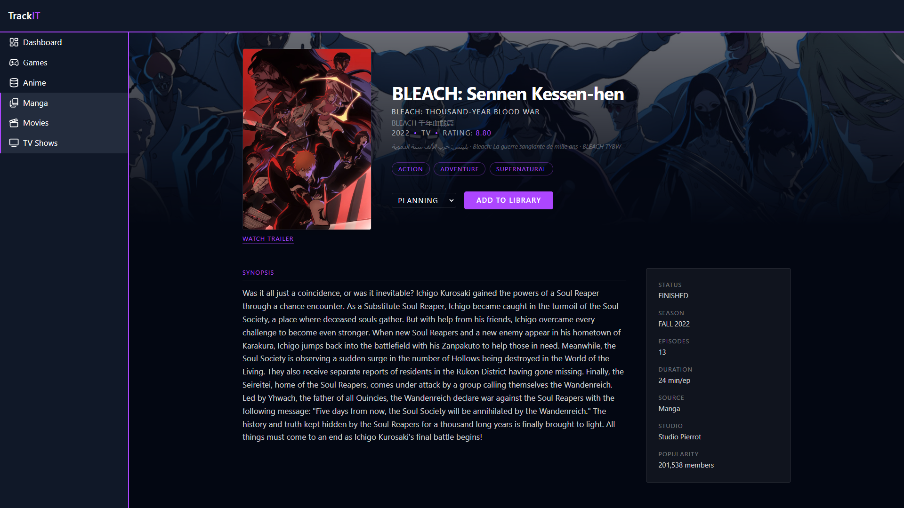
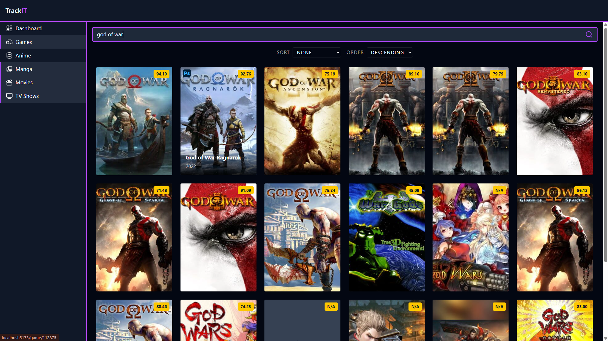
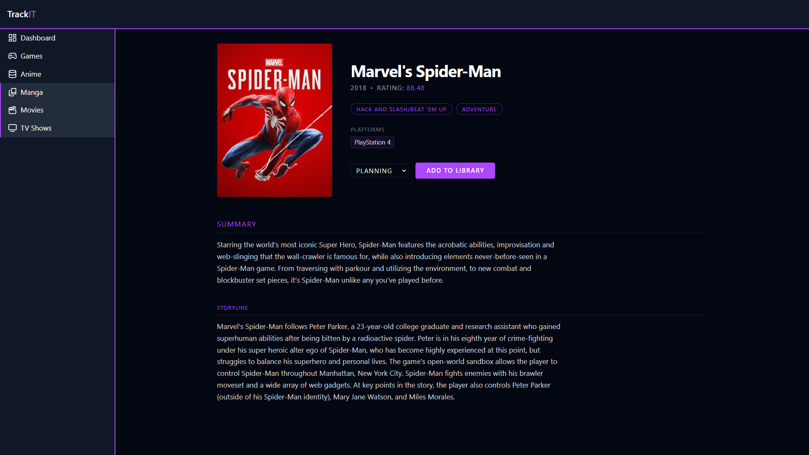
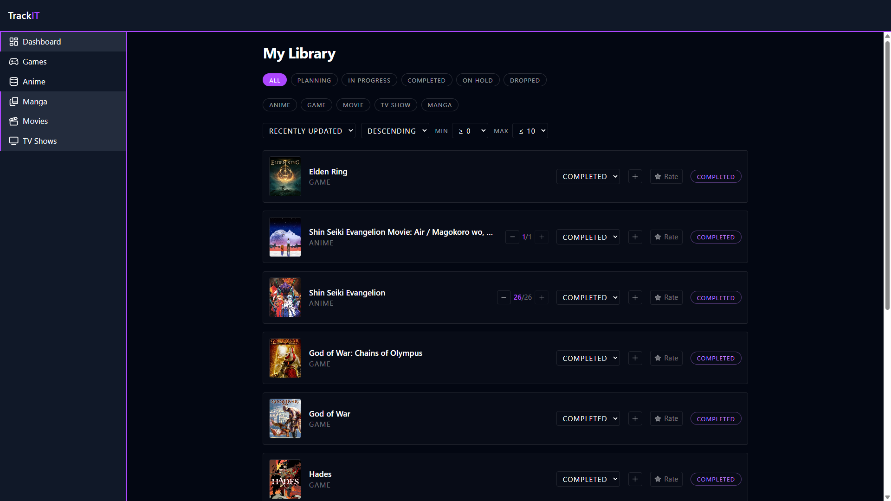

# TrackIt

A media tracking application with FastAPI backend and React frontend.

## Features

- Track games, anime
- User authentication with JWT tokens
- Integration with IGDB and AniList APIs

## Tech Stack

**Backend:** FastAPI, SQLAlchemy, PostgreSQL, Alembic
**Frontend:** React, TypeScript, Vite, TanStack Query

## Environment Variables

### Backend (.env)

| Variable | Description | Required |
|----------|-------------|----------|
| `SQLALCHEMY_DATABASE_URL` | PostgreSQL connection string | Yes |
| `SECRET_KEY` | JWT signing secret | Yes |
| `ALGORITHM` | JWT algorithm (e.g., HS256) | Yes |
| `ACCESS_TOKEN_EXPIRE_MINUTES` | Token expiry in minutes | Yes |
| `DEBUG` | Enable debug mode (disables Secure cookie flag) | No (default: false) |
| `TWITCH_DEVELOPER_CLIENT_ID` | Twitch/IGDB client ID | Yes |
| `TWITCH_DEVELOPER_CLIENT_SECRET` | Twitch/IGDB client secret | Yes |
| `FRONTEND_ORIGIN` | Frontend URL for CORS (e.g., `http://localhost:5173`) | Yes |

### Frontend (.env)

| Variable | Description | Required |
|----------|-------------|----------|
| `VITE_API_BASE_URL` | Backend API base URL | Yes |


## Development Setup

### Backend

```bash
cd backend
uv sync
# Create .env from .env.example and fill in values
uv run alembic upgrade head
uv run uvicorn app.main:app --reload
```

### Frontend

```bash
cd frontend
npm install
# Create .env with VITE_API_BASE_URL
npm run dev
```

### Screenshots

#### Anime Search Page


#### Anime Detail Page


#### Game Search Page


#### Game Detail Page


#### Your Library Page



